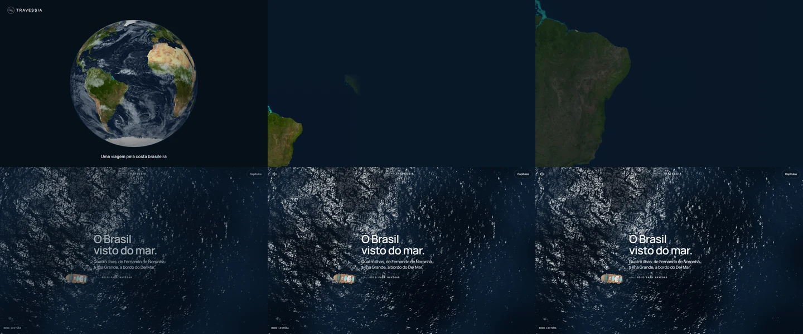
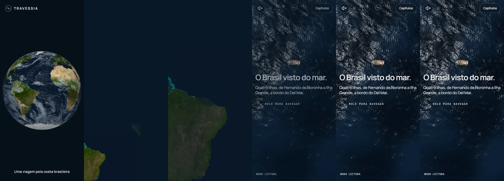

# Issue #66 verification

The Approach now uses three offline projections of retained NASA Blue Marble
surface/cloud imagery. Source bytes, rights and transformations are documented
in [NASA provenance](../../third-party/nasa-blue-marble.md).

These contact sheets show the actual production camera behind the CSS Approach
at 1440×900 and 390×844, captured in headless Chrome on the Windows host. Each
sheet follows 0, 864, 1500, 1900, 2250 and 2400 ms (desktop: across then down;
phone: left to right). The initial frame holds the vessel request. Once the
ocean is ready, CSS animation times are frozen for each capture; the ocean
continues rendering. The coastal crop stays attached to the viewport edges,
and the graded deep water fades into the scene over the final 800 ms.
Phone captures simulate a viewport, with separate DPR 2 resolution checks.

The final [budget measurements](budgets.json) retain the served build ID.
Minimum-sailable payload counts essential responses, including the globe;
`initialTransfer` retains all startup downloads, including optional imagery and
terrain. The complete-visit total counts every response. No budget was raised.

Validation completed:

- 260 unit tests; updated asset-change detection and production asset checks.
- 37 entry tests across Chromium, Firefox and WebKit; 15 focused descent,
  fallback and DPR 2 checks repeated after the coastal framing adjustment.
- Two production request/provenance/scene-budget tests.
- Production build (including TypeScript), lint and asset audit.
- Repeated offline Earth build with identical output SHA-256 hashes.
- Desktop/phone native-resolution checks at DPR 2, with JavaScript blocked.
- Blocked and late close-image requests select the 1.2 s fallback; reduced
  motion keeps the globe still and uses a 480 ms fade.

All three images are native 4096 px. The globe is 406,404 bytes (396.9 KiB),
and the optional Atlantic/water levels total 125,308 bytes (122.4 KiB), below
their 450 KiB and 250 KiB ceilings. Only the globe is preloaded; the optional
images use eager, low-priority requests so React does not preload them.
